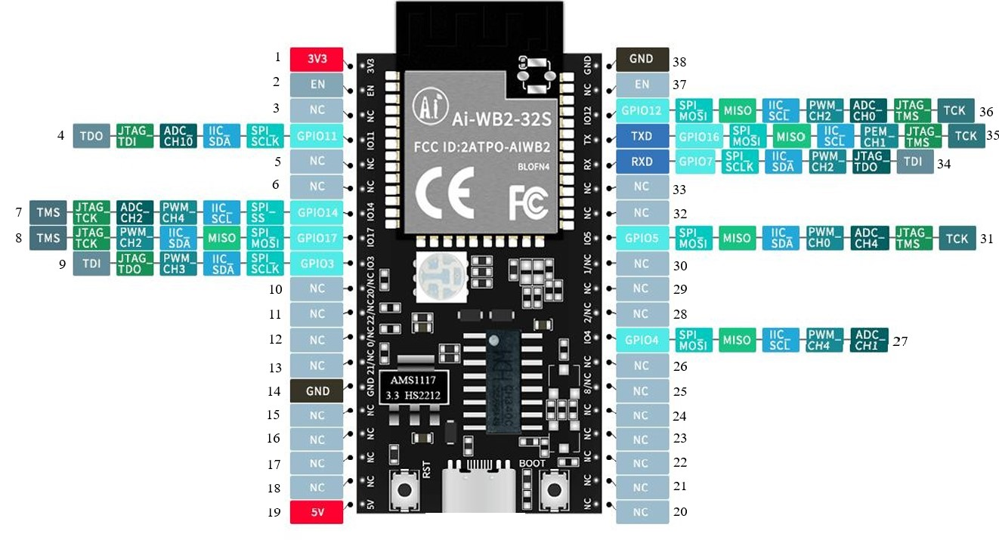

# **Guía Rápida Tarjeta de identificación AI-WB2-32S-KIT**
Esta implementación de Aixt que soporta la tarjeta AI-WB2-32S-KIT

## Visualización
* *En el Ai-WB2-32S-Kit, se conectan un total de 38 interfaces; por ejemplo, la tabla de definición de la función de los pines corresponde a la definición de las interfaces.*


*Image taken from the device datasheet*

## Ficha técnica
[AI-WB2-32S-KIT](http://www.ai-thinker.com/Uploads/file/20221008/20221008082356_37940.pdf)

## Identificación de Puertos
A continuación, se indican los puertos utilizados y sus designaciones correspondientes para programación:

No.| Nombre   | Función 
-- |-----     |---
1  |3V3       |Fuente de alimentación de 3.3V; Se recomienda que la corriente de salida de la fuente de alimentación externa sea superior a 500mA
2  |EN        | Por defecto, está habilitado como un chip, y el nivel alto es efectivo 
3  |NC        | Pines vacíos
4  |IO11      | GPIO11/SPI_SCLK/IIC_SDA/ADC_CH10/JTAG_TDI/TDO 
5  |NC        | Pines vacíos 
6  |Empty feet| Pines vacíos 
7  |IO14      | GPIO14/SPI_SS/IIC_SCL/PWM_CH4/ADC_CH2/JTAG_TCK/TMS 
8  |IO17      | GPIO17/SPI_MOSI/MISO/IIC_SDA/PWM_CH2/JTAG_TCK/TMS 
9  |IO3       | GPIO3/SPI_SCLK/IIC_SDA/PWM_CH3/JTAG_TDO/TDI 
10 |IO20/NC   | El NC predeterminado no está disponible 
11 |IO22/NC   | El NC predeterminado no está disponible 
12 |IO0/NC    | El NC predeterminado no está disponible
13 |IO21/NC   | El NC predeterminado no está disponible
14 |GND       | Tierra
15 |NC        | Pines vacíos 
16 |NC        | Pines vacíos 
17 |NC        | Pines vacíos 
18 |NC        | Pines vacíos 
19 |5V        | Fuente de alimentación de 5V; Se recomienda que la corriente de salida de la fuente de alimentación externa sea superior a 500mA 
20 |NC        | Pines vacíos 
21 |NC        | Pines vacíos 
22 |NC        | Pines vacíos 
23 |NC        | Pines vacíos 
24 |NC        | Pines vacíos
25 |IO8/NC    | El NC predeterminado no está disponible 
26 |NC        | Pines vacíos 
27 |IO4       | GPIO4/SPI_MOSI/MISO/IIC_SCL/PWM_CH4/ADC_CH1 
28 |IO2/NC    | El NC predeterminado no está disponible
29 |NC        | Pines vacíos
30 |IO1/NC    | El NC predeterminado no está disponible 
31 |IO5       | GPIO5/SPI_MOSI/MISO/IIC_SDA/PWM_CH0/ADC_CH4/JTAG_T MS/TCK 
32 |NC        | Pines vacíos 
33 |NC        | Pines vacíos 
34 |RX        | RXD/GPIO7/SPI_SCLK/IIC_SDA/PWM_CH2/JTAG_TDO/TDI 
35 |TX        | TXD/GPIO16/SPI_MOSI/MISO/IIC_SCL/PWM_CH1/JTAG_TMS/T CK 
36 |IO12      | GPIO12/SPI_MOSI/MISO/IIC_SCL/PWM_CH2/ADC_CH0/JTAG_T MS/TCK 
37 |NC        | Pines vacíos 
38 |GND       | Tierra

## Programación en lenguaje V
Para cada uno de estos módulos, dispondrá de un archivo en formato .c.v con el mismo nombre del módulo y, dentro de este, encontrará el texto "module" seguido del nombre del módulo; por ejemplo:
* module pin
* module pwm
* module uart

### Configuración del puerto de salida
Para activar el puerto a utilizar
```v
pin.setup(pin_name, pin.output)
```
* *Ejemplo: Si desea activar el puerto 17; pin.setup(pin.io17, pin.output). Para activar el puerto a utilizar
```v
pin.high(pin_name)
```
* *Ejemplo: Si desea deactivar el puerto 17;  `pin.high(pin.io17)`.*

Para desactivar el puerto que se está utilizando
```v
pin.low(pin_name)
```
* *Example: Si desea deactivar el puerto  17;  `pin.low(pin.io17)`.*

Para desactivar o activar el puerto en uso

```v
pin.write(pin_name, VALUE)
```
* *Example: Si desea desactivar el puerto 17 `pin.write(pin.io17, 1)`,y si desea activar  `pin.write(pin.io17, 0)`.*

### Detección del puerto de entrada

Si necesita saber en qué estado se encuentra un puerto de entrada:
```v
x = pin.read(pin_name)
```

* *Ejemplo: Si desea detectar el VALOR del puerto 3; `x = pin.read(pin.io3)`, y `x` tomará el VALOR de 0 o 1, dependiendo de qué puerto esté activo o desactivado.*

### Modulación por Ancho de Pulso (Salidas PWM)

Para configurar algún PWM
```v
pin.setup(pin_name, pin.output)
```
* *Ejemplo: en pwm usted configura el PWM a utilizar `pin.setup(pin.io17, pin.output)`*


Para configurar el ciclo de trabajo de un modulador

Todo está implementado dentro de un bucle for, con un contador hasta los ciclos deseados

```v
pwm.write(pin_name, pin.output)
```
* *Ejemplo: en pwm usted configura el PWM a utilizar* 
```v
for {
    pwm.write(pin.io17, val)
    sleep_ms(250)
    val += 10
    if val == 250 {
		  val = 0  
    }
}
```

### Comunicación serial (UART)

El UART solía ser la salida de flujo estándar, por lo que las funciones `print()`, `println()` e `input()` funcionan directamente en el UART predeterminado. El UART predeterminado podría cambiar dependiendo de la placa o el microcontrolador; consulte la documentación específica. La sintaxis para la mayoría de las funciones UART es: `uart_function_name_x()`, siendo `x`  el número de identificación en caso de múltiples UART. Puede omitir la `x` para referirse al primer UART o al UART predeterminado, o en el caso de tener solo uno. 

### Configuración UART

Para el módulo UART se implementa de la siguiente manera:
```v 
uart.setup(BAUD_RATE)
```
- `BAUD_RATE` configura la velocidad de comunicación
* *Ejemplo: en uart para usar `uart.setup(115200)`*
### Transmisión serial

```v
uart.print(message)      // imprime una cadena al UART predeterminado
```
* *Ejemplo: Esto se usa como: `uart.print(Uart for AIXT)`*
```v
uart.println(message)    // imprime una cadena más un carácter de nueva línea al UART predeterminado
```
* *Ejemplo: Esto se usa como `uart.println(Command received)`*
```v
uart.ready // prepara todo para el UART
```
* *Ejemplo: Esto se usa como `uart.ready()`*
```v
uart.read // recibe datos binarios (en Bytes) al UART
```
* *Ejemplo: Esto se usa como `uart.read()`*
```v
uart.write(message)    // envía datos binarios (en Bytes) al segundo UART
```
* *Ejemplo: Esto se usa como `uart.write()`*

### Retardos

* Uso de tiempos

    * En cada expresión, el VALOR de tiempo se coloca dentro de los paréntesis.
```v
time.sleep(s) //Segundos
```
* *Ejemplo: Esto se usa como `time.sleep(2)`*
```v
time.sleep_ms(ms) //Milisegundos
```
* *Ejemplo: Esto se usa como `time.sleep_ms(500)`*
```v
time.sleep_us(us) //Microsegundos
```
 *Ejemplo: Esto se usa como `time.sleep_us(5000)`*

## Implementación del proyecto AIXT 

Para el desarrollo del programa, se muestran algunos ejemplos de los códigos en lenguaje v, los cuales serán transpilados
* Ejemplo parpadeo de LED

```v
import pin
import time {sleep_ms}

pin.setup(pin.io14, pin.output)

for {   //infinite loop
    pin.high(pin.io14)
    sleep_ms(500)
    pin.low(pin.io14)
    sleep_ms(500)
}
```
* Ejemplo PWM
```v
import time {sleep_ms}
import pin
import pwm

__global val = 0

pin.setup(pin.io17, pin.output)

for {
    pwm.write(pin.io17, val)
    sleep_ms(250)
    val=val+10
    if val==250{
		val=0  
    }
} 
```

* Ejemplo UART
```v
import time {sleep_ms}
import pin
import uart


  uart.setup(115200)
  pin.setup(pin.io4,output)
  pin.setup(pin.io5,output)
  pin.setup(pin.io12,output)

for {
  uart.println("\r\n Este programa realiza unas funciones establecidas:")
  uart.println("\r\n Oprimiendo la letra A, activa la salida  del pin GPIO4.")
  uart.println("\r\n Oprimiendo la letra B, activa la salida  del pin GPIO5.")
  uart.println("\r\n El piloto (led) Rojo indica que esta esperando instrucciones.")
  uart.println("\r\n Esperando instrucciones: \r\n")

  pin.high(pin.io12)
  sleep_ms(500)

  pin.low(pin.io12)
  sleep_ms(500)
  x:=0
  x=uart.available()
  if  x> 0 {
  command := ` `
	command = uart.read_0()

    if command==`A` {
        uart.println("\r\n Comando A recibido. \r\n")
        uart.println("\r\n Realizando acción A. \r\n")
        pin.high(pin.io4)
        sleep_ms(5000)

        pin.low(pin.io4)
        sleep_ms(1000)
        uart.println("\r\n Proceso A finalizado. \r\n")
	}

      if command==`B` {
        uart.println("\r\n Comando B recibido. \r\n")
        uart.println("\r\n Realizando acción B. \r\n")
        pin.high(pin.io5)
        sleep_ms(5000)

        pin.low(pin.io5)
        sleep_ms(1000)
        uart.println("\r\n Proceso B finalizado. \r\n")
	  }

      else {
        pin.high(pin.io12)
        sleep_ms(1000)

        pin.low(pin.io12)
        sleep_ms(1000)
      
    }
  }
}
```

## Video informativo
Video informativo sobre el desarrollo del proyecto AIXT, con el dispositivo

<div style="text-align: center;" markdown="1">
  <iframe width="960" height="540" src="https://www.youtube.com/embed/BRSWZXQ2mLY?si=Mfr6su3AmdzriFUd" title="YouTube video player" frameborder="0" allow="accelerometer; autoplay; clipboard-write; encrypted-media; gyroscope; picture-in-picture; web-share" referrerpolicy="strict-origin-when-cross-origin" allowfullscreen></iframe>
</div>