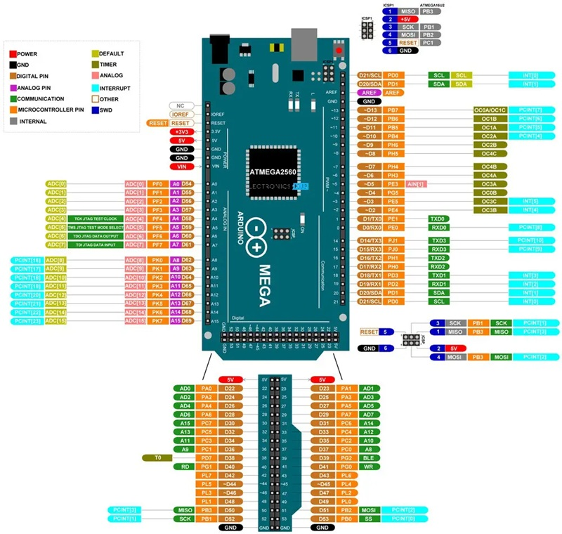

# **Referencia rápida para la placa Arduino Mega**

## CONFIGURACIÓN DE PINES Y SUS RESPECTIVAS FUNCIONES




## Retardo
Use el módulo `time`:

```v
import time

time.sleep(2)            // esperar por 2 segundos
time.sleep_ms(50)        // esperar por 50 milisegundos
time.sleep_us(100)       // esperar por 100 microsegundos
```

### Funciones
nombre                | descripción
----------------------|----------------------
`time.sleep(time)`    | Retraso en segundos
`time.sleep_us(time)` | Retraso en microsegundos
`time.sleep_ms(time)` | Retraso en milisegundos


## LEDs Internos
El LED integrado se denomina `led_0` 

```v
import pin

pin.setup(led_0, pin.output)
pin.high(led_0)
```


## Pines
Utilice el módulo `pin`:

```v
import pin

pin.setup(pin.d0, pin.input)
pin.high(pin.d13)
pin.low(pin.d3)
pin.write(pin.d8, pin.read(pin.d0)) // pin echo
```

### Funciones
nombre                  | descripción
------------------------|--------------------------
`pin.setup(pin, mode)`  | Configurar `pin` como `modo`
`pin.high(pin)`         | Encender `pin`
`pin.low(pin)`          | Apagar `pin`
`pin.write(pin, value)` | Escribir `valor` en `pin`
`pin.read(pin)`         | Devuelve el estado de `pin`


### Nombres de los pines digitales
Los nombres de los pines digitales se denominan a partir de `d0` hasta `d69`.


## Puertos de pin
Use el módulo `port`:

```v
import port

port.setup(port.b, port.all_outputs)
port.setup(port.c, port.all_inputs)  // puerto A bit 7 y 6 como salidas, el resto como entradas

val := port.read(port.c)
port.write(port.b, val) // puerto echo
```

### Funciones
nombre                    | descripción
--------------------------|---------------------------
`port.setup(port, mode)`  | Configurar el `puerto`como `modo`
`port.read(port)`         | Devuelve el valor de `puerto`
`port.write(port, value)` | Escribe el `valor` para `puerto`

### Nombres de los puertos digitales
|Puertos| nombre Aixt|
|:----: |:---------: |
| **B** | `b`        |
| **C** | `c`        |
| **D** | `d`        |
| **E** | `e`        |
| **F** | `f`        |
| **G** | `g`        |
| **H** | `h`        |
| **J** | `j`        |
| **K** | `k`        |


## PWM (Modulación por ancho de pulsos)
Use el módulo `pwm`:

```v
import pwm

pwm.write(pwm.ch0, 40)       // Establecer el ciclo de trabajo para el canal PWM 0
pwm.write(pwm.ch1, 60)       // Establecer el ciclo de trabajo para el canal PWM  1
```

### Funciones
nombre                      | descripción
----------------------------|-----------------------------------
`pwm.write(channel, value)` | Escribir `valor` en el `canal` PWM

### Nombre de los pines PWM 
Los canales PWM son nombrados desde `ch0` hasta `ch11`.


## CAD (Convertidor de analógico a digital)
Use el módulo `adc`:

```v
import adc

val1 := adc.read(ch0)       // lectura de CAD canal 0
val2 := adc.read(ch1)       // lectura de CAD canal 1
```

### Funciones
nombre              | descripción
--------------------|----------------------------------
`adc.read(channel)` | Devuelve el valor del ADC en `canal`

### Canales analógicos
Los canales PWM fueron nombrados desde `ch0` hasta `ch15`.


## UART (Puerto serial)
Utilice el módulo `uart0` , `uart1` , `uart2` o `uart3`:

```v
import uart

uart.print('Hello ')
uart.println('World...')
```

### Funciones
nombre                   | descripción
-------------------------|---------------------------------------------------------------
`uart.setup(baud_rate)`  | Configurar el `baud_rate` de la UART
`uart.read()`            | Devuelve un carácter recibido por UART
`uart.input(message)`    | Envía el `mensaje` y devuelve la cadena recibida por UART
`uart.write(character)`  | Envía un carácter por UART
`uart.print(message)`    | Envía el `mensaje` por UART
`uart.println(message)`  | Enviar el `mensaje` más una nueva línea por UART
`uart.any()`             | Devuelve el número uf caracteres en el buffer de la UART
`uart1.setup(baud_rate)` | Configurar el `baud_rate` de la UART 1
`uart1.ready()`          |
`uart1.read()`           | Devuelve un carácter recibido por la UART 1
`uart1.print(message)`   | Envía el `mensaje` por UART 1
`uart1.println(message)` | Enviar el `mensaje` más una nueva línea por UART 1
`uart1.any()`            | Devuelve el número uf caracteres en el buffer de la UART1
`uart2.setup(baud_rate)` | Configurar el `baud_rate` de la UART 2
`uart2.ready()`          |
`uart2.read()`           | Devuelve un carácter recibido por la UART 2
`uart2.print(message)`   | Envía el `mensaje` por UART 2
`uart2.println(message)` | Enviar el `mensaje` más una nueva línea por UART 2
`uart2.any()`            | Devuelve el número uf caracteres en el buffer de la UART2
`uart3.setup(baud_rate)` | Configurar el `baud_rate` de la UART 3
`uart3.ready()`          |
`uart3.read()`           | Devuelve un carácter recibido por la UART 3
`uart3.print(message)`   | Envía el `mensaje` por UART 3
`uart3.println(message)` | Enviar el `mensaje` más una nueva línea por UART 3
`uart3.any()`            | Devuelve el número uf caracteres en el buffer de la  UART2