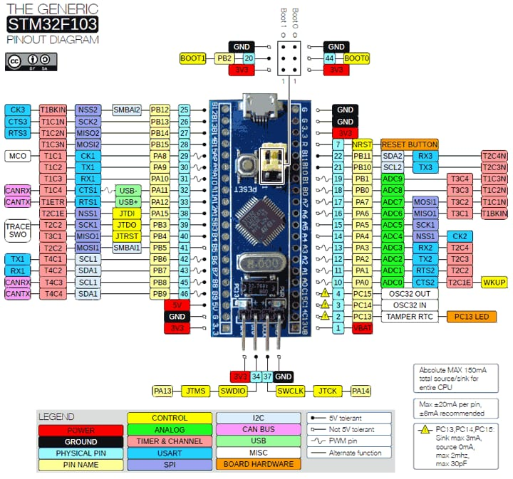

# **Guía rápida STM32F103C**
Esta implementación de Aixt que admite la tarjeta Blue Pill STM32F103C

## Vista
**AIR32F103C, se conectan un total de 44 interfaces, por ejemplo, la tabla de definición de función de pin es la definición de interfaz.**


*Imagen tomada de la hoja de datos del dispositivo.*

## Datasheet
[AIR32F103C](https://wiki.luatos.org/chips/air32f103/mcu.html)
Para programar la tarjeta STM32F103C se debe conectar el ST, por lo que se recomienda ver la hoja de datos: 
[ST LINK-V2](https://www.waveshare.com/wiki/ST-LINK/V2_(mini))

## Identificación del puerto
A continuación se muestran los puertos utilizados y sus designaciones adecuadas para la programación:

No.| Nombre   | Función 
-- |-----     |---
1  |PC14      | OSC32_IN
2  |PC15      | OSC32_OUT              
3  |GND       | TIERRA DE LA TARJETA BLUE PILL AIR32F103C
4  |5V        | ENTRADA 5V BLUE PILL AIR32F103C
5  |PA0       | WKUP/USART2_CTS/ADC12_IN0/TIM2_CH1_ETR/TIM5_CH1
6  |PA1       | USART2_RTS/ADC12_IN1/TIM2_CH2/TIM5_CH2
7  |PB9       | PWM
8  |PB8       | TIM4_CH
9  |3.3V      | ENTRADA 3.3V BLUE PILL AIR32F103C 
10 |GND       | TIERRA DE LA TARJETA BLUE PILL AIR32F103C
11 |PA2       | USART2_TX/ADC12_IN2/TIM2_CH3/TIM5_CH3
12 |PA3       | USART2_RX/ADC12_IN3/TIM2_CH4/TIM5_CH4
13 |PA4       | SPI1_NSS/USART2_CK/DAC_OUT1/ADC12_IN4
14 |PA6       | SPI1_MISO/ADC12_IN6/
15 |PA7       | SPI1_MOSI/ADC12_IN7/TIM3_CH2
16 |PA5       | SPI1_SCK/ADC12_IN5/DAC_OUT2
17 |3.3V      | ENTRADA 3.3V BLUE PILL AIR32F103C 
18 |GND       | TIERRA DE LA TARJETA BLUE PILL AIR32F103C
19 |PB0       | ADC12_IN8/TIM3_CH3
20 |PB1       | ADC12_IN9/TIM3_CH4
21 |PB5       | I2C1_SMBA/SPI3_MOS
22 |PB4       | SPI3_MIS
23 |5V        | ENTRADA 5V BLUE PILL AIR32F103C
24 |PWB       |         
25 |GND       | TIERRA DE LA TARJETA BLUE PILL AIR32F103C
26 |3.3V      | ENTRADA 3.3V BLUE PILL AIR32F103C 
27 |RST       | REINICIO DE SALIDA 
28 |PB3       | SPI3_SCK
29 |PA15      | SPI3_NS
30 |PA10      | UART 0_RX


31 |PA9       | UART 0_TX
32 |GND       | TIERRA DE LA TARJETA BLUE PILL AIR32F103C
33 |PB6       | I2C1_SCL/TIM4_CH
34 |PB7       | I2C1_SDA/TIM4_CH
35 |PA8       | USART1_CK/TIM1_CH1/MCO
36 |PB15      | SPI2_MOSI/TIM1_CH3N 
37 |PB14      | SPI2_MISO/USART3_RTS/TIM1_CH2N
38 |GND       | TIERRA DE LA TARJETA BLUE PILL AIR32F103C
39 |PB13      | SPI2_SCK/USART3_CTS/TIM1_CH1N
40 |PB12      | SPI2_NSS/I2C2_SMBA/USART3_CK/TIM1_BKIN
3.3V          | ELECTRICAL POWER SUPPLY 3.3V BLUE PILL AIR32F103C
PB14          | ISPI2_MISO/USART3_RTS/TIM1_CH2N
PB13          | ISPI2_MISO/USART3_RTS/TIM1_CH1N
GND           | GROUND CONNECTOR ST-LINK V2
PC13          | TAMPER-RTC
GND           | GROUND CONNECTOR ST-LINK V2
SWDIO|PA13    |
SWCLK|PA14    |
3.3V          | ELECTRICAL POWER SUPPLY 3.3V BLUE PILL AIR32F103C
PB2           | LED 1 AZUL
PB10          | LED 2 VERDE
PB11          | LED 3 ROJO


## Entrada y Salida Digitales
Para reconocer las entradas y salidas digitales, se prueban los puertos de entrada y salida de la tarjeta, respectivamente. Para ello, se programa un código que permite probar los puertos identificados uno por uno (esquema 2). tales como: A0,A1,A2,A3,A4,A5,A6,A7,B0,B1,B8,B9, los antes mencionados también pueden ser utilizados como salidas ya que los pines de la tarjeta permiten ambas funciones según como estén catalogados en programación, la diferencia entre estos puertos o pines será que algunos soportan voltajes de exactamente 5 voltios y otros que soportan voltajes menores a 5 voltios, para este tipo de pines que no soportaban voltajes que llegasen a 5 voltios se hicieron pruebas con un voltaje de 3.3 voltios, para poder entregar los 3.3 voltios y 5 voltios a la tarjeta se utiliza un quemador ST-LINK V2 el cual nos permite seleccionar entre estos dos voltajes cual queremos entregar y nos permite sincronizar el programa que tengamos en la tarjeta. Aplicación IDE ARDUINO 2.2.1 Placa STM32VLD a FLASH y placa AIR32F103C.

## Entrada y Salida Analógica
Para determinar cuáles son las entradas analógicas, se realiza el mismo proceso de prueba de puertos realizado anteriormente, con la diferencia de que solo se probarán los puertos que permiten recibir y transmitir señales analógicas, lo que permite modificar la amplitud y el período de la señal. En este caso, la señal se refleja al usar un potenciómetro, que funciona como una resistencia variable con un valor entre 0 Ω y 10 kΩ y regula el nivel de voltaje que este dispositivo suministrará a la entrada de nuestro LED. El LED está protegido por una resistencia de 330 Ω. Este circuito nos permitirá observar cómo varía la intensidad luminosa del LED según el valor de Ω asignado al potenciómetro. Durante la verificación, se obtiene que los puertos que permiten la transferencia de señales analógicas para nuestra tarjeta AIR32F103C son A8, A9, A10, B3, B4, B5, B6, B7, B12, B13, B14 y B15.

## Señal  PWM 
Para identificar el puerto de señal PWM de la tarjeta AIR32F103 se prueban los puertos de la tarjeta para saber cuál de ellos nos proporciona dicha función, así podemos obtener una señal PWM utilizando como entrada una señal analógica modulando el ancho de los pulsos generados por los puertos de salida a través de, durante la identificación se obtiene que los pines que permiten la emisión de una señal PWM son A6, A7,A8,A9,A10, B1, B4,B6,B7,B9, para tal efecto se realizó la programación de un código el cual permitió reconocer uno a uno los puertos identificados anteriormente y el cual se puede ver en el (esquema 2).

## Comunicación UART
Para establecer los puertos de la tarjeta que nos permitan tener comunicación UART se utiliza como entrada los 3.3 V que proporciona la tarjeta AIR32F103, el voltaje de entrada se regula por medio de un potenciómetro que al girar su perilla y mediante comunicación entre las tarjetas a través del puerto UART permite encender y apagar leds asignados en la tarjeta STM32F103C, cuando nuestro dispositivo de regulación de voltaje esté en su valor mínimo de resistencia el led verde debe estar encendido, cuando llegue al valor medio de resistencia debe encender el led amarillo y cuando llegue a su valor máximo de resistencia debe encender el led rojo a la entrada, se debe conectar un led a cada puerto, para hacer esto se conectarán estas dos tarjetas a través del puerto UART genérico, es decir conectar el puerto PA9 (TX) de la tarjeta AIR32F103C con el puerto PA10 (RX) de la tarjeta STM32F103C y el puerto PA10 (RX) de la tarjeta AIR32F103C con el puerto PA9 (TX) de la Tarjeta STM32F103C.

## Programación en Lenguaje v
Para cada uno de estos módulos, tendrás un archivo en formato .cv con el mismo nombre del módulo y en este tendrás el texto módulo seguido del nombre del módulo, ejemplo:
* module pin
* module adc
* module pwm
* module uart


### Configuración del Puerto de Salida
Para activar el puerto a utilizar
```v
pin.setup(pin_name, mode)
```
Para activar el puerto a utilizar
```v
pin.high(PIN_NAME)
```
* *Ejemplo: Si desea activar el puerto 17;  `pin.high(17)`.*

Para deshabilitar el puerto que se está utilizando
```v
pin.low(PIN_NAME)
```
* *Ejemplo: Si desea deshabilitar el puerto 17;  `pin.low(17)`.*

Para deshabilitar o habilitar el uso del puerto

```v
pin.write(PIN_NAME, VALUE)
```
* *Ejemplo: Si desea deshabilitar el puerto 17 `pin.write(17, 1)`,  y si desea activarlo  `pin.write(17, 0)`.*

### Detección del Puerto de Entrada

Si necesita saber en qué estado se encuentra un puerto de entrada:
```v
x = pin.read(PIN_NAME)
```

* *Ejemplo: Si desea detectar el VALOR del puerto 3; `x = pin.read(17)`, y `x` tomará el VALOR de 0 o 1, dependiendo de qué puerto esté activo o deshabilitado.*

### Puertos Analógicos a Digitales (ADC)

Para configurar uno de los puertos analógicos
```v
adc.setup(PIN_NAME, SETUP_VALUE, ... )
```
* *En PIN_NAME se ingresa el nombre del puerto analógico, en SETUP_VALUE el VALOR que se dará es dicho puerto..*

Para detectar el VALOR del puerto analógico
```v
x = adc.read(PIN_NAME)
```
* *En `PIN_NAME` el nombre del puerto analogico se ingresa, y `x` toma el VALOR de dicho puerto.*

## Modulación por Ancho de Pulso (salidas PWM)

Para configurar algún PWM
```v
pwm.setup(SETUP_VALUE, setup_VALUE_1, ... )
```
* *En pwm estableces el PWM a utilizar, y en SETUP_VALUE el VALOR al que quieres configurar dicho pwm.*


Para configurar el ciclo de trabajo de un modulador
```v
pwm.write(duty)
```
* *En PWM se fija el pwm a utilizar, y en `duty` el VALOR del ciclo (de 0 a 100) en porcentaje.*

## Comunicación Serial (UART)

El UART solía ser la salida de flujo estándar, por lo que las funciones `print()`, `println()` y `input()` funcionan directamente en el UART predeterminado. El UART predeterminado puede variar según la placa o el microcontrolador; consulte la documentación específica. La sintaxis de la mayoría de las funciones UART es `uart_function_name_x()`, donde `x` es el número de identificación en caso de múltiples UART. Puede omitir `x` para referirse al primer UART o al predeterminado, o en caso de tener solo uno.  

### Configuración UART 

```v
uart.setup(BAUD_RATE)   // the same of uart.setup(BAUD_RATE)
```
Para una segunda conexión se utiliza como:
```v 
uart.setup_1(BAUD_RATE)   // the same of uart.setup_1(BAUD_RATE)
```
- `BAUD_RATE` configurar la velocidad de comunicación
### Transmisión Serial

```v
uart.print(message)      // print a string to the default UART
```
```v
uart.println(message)    // print a string plus a line-new character to the default UART
```
```v
uart.ready // get everything ready for to UART
```
```v
uart.read // receives binary data (in Bytes) to UART
```
```v
uart.write(MESSAGE)    // send binary data (in Bytes) to second UART
```
- Para un segundo UART se utilizaría de la siguiente manera:
```v
uart.print_1(MESSAGE)    // print a string to the second UART
```
```v
uart.println_1(MESSAGE)  // print a string plus a line-new character to the second UART
```
```v
uart.write_1(MESSAGE)    // send binary data (in Bytes) to second UART
```
```v
uart.ready_1 // get everything ready for to second UART
```
```v
uart.read_1 // receives binary data (in Bytes) to second UART
```

### Retardos

* Uso de los tiempos

    * En cada expresión, el VALOR del tiempo se coloca dentro de los paréntesis.
```v
time.sleep(S) //Seconds
```
```v
time.sleep_ms(MS) //Milliseconds
```
```v
time.sleep_us(US) //Microseconds
```

* Ejemplo de LED parpadeante

```v
import pin
import time {sleep_ms}

pin.setup(14, pin.output)

for {   //infinite loop
    pin.high(14)
    sleep_ms(500)
    pin.low(14)
    sleep_ms(500)
}
```

* Ejemplo de entrada y salida digital
```v
const int ledPIN1 = PA3; //salida digital al led PA3

const int intPIN = PA0; //entrada digital al led PA0
void setup() {
     Serial.begin(9600);
     // put your setup code here, to run once:
     pinMode(ledPIN1, pin.OUTput);//led conectado a salida PA3
      pinMode(intPIN, pin.INput);//interruptor conectado a entrada PA0
}
void loop() {
  // put your main code here, to run repeatedly:
  if (digitalRead(intPIN)==LOW){
    //INTERRUPTOR PRESIONADO
  digitalWrite(ledPIN1, LOW); //LED conectado a PA3
   }
    else{
    //interruptor suelto

  digitalWrite(ledPIN1, LOW);  //LED conectado a PA3
    }  
 delay (1);
}
```

* Ejemplo de entrada y salida analógica y señal PWM

```v
define LED_BUILTIN 2

#include <PWMOutESP32.h> //https://github.com/fellipecouto/PWMOutESP32 [ http://www.efeitonerd.com.br ]

//Resolution between 1 and 16 (bits). Frequency between 1 and 40000 (Hz)
PWMOutESP32 pwm(10, 5000); //Resolution=10bits, Frequency=5000Hz

void setup() {
  Serial.begin(115200);
  pinMode(LED_BUILTIN, pin.OUTput);

  Serial.println("\nPWMOutESP32");
  Serial.println("Library for controlling ESP32 PWM outputs similar to use on Arduino");
  Serial.print("Maximum PWM value for the configured resolution: ");
  Serial.println(pwm.getMaxPWMValue());
}

void loop() {

  for (int fadeValue = 0; fadeValue <= pwm.getMaxPWMValue(); fadeValue++)  {
    pwm.analogWrite(LED_BUILTIN, fadeValue);
    delay(2);
  }
  delay(500);

   for (int fadeValue = pwm.getMaxPWMValue(); fadeValue >= 0; fadeValue--)  {
    pwm.analogWrite(LED_BUILTIN, fadeValue);
    delay(2);
  }
  delay(500);

}


```

* Ejemplo de puerto de comunicación UART


```v
for AIR32F103 as emisor:

long Dato;//Dato como entero
char EnviaDato;//creacion enviar dato como Char

void setup() {
  // put your setup code here, to run once:
Serial.begin(9600);//velocidad en Baudios
Serial.println("Inicio de sketch - valores del potenciometro");
}

void loop() {
  Dato=analogRead(PA5);//velocidad en Baudios
  delay(100);
  Serial.println(Dato);
  if(Dato <=600){//Valor menor a 400
  Serial.write('1');//Envia dato 1 a STM32
  }

 else {
  Serial.write('3');//Envia dato 1 a STM32
  }
}

for AIR32F103 as receptor:

int LEDPinI=PA4;//LEDPinI asignado al pin PA4
int LEDPinII=PA6;//LEDPinI asignado al pin PA6
int RecibeDato;
void setup() {
pinMode(LEDPinI,OUTPUT);//LEDPinI asignado
//como salida
pinMode(LEDPinII,OUTPUT);//LEDPinII asignado
//como salida

Serial.begin(9600);//Velocidad en Baudios
}
void loop() {
  if(Serial.available()>0){//Comparacion serial
  //Mayor a cero
    RecibeDato=Serial.read();//Recibe dato STM32
    delay(100); //Reset 100 ms
  }
  switch(RecibeDato){
    case '1':
    digitalWrite(LEDPinI,HIGH);//LEDPinI encendido
    digitalWrite(LEDPinII,LOW);//LEDPinII apagado
    break;
    case '2':
    digitalWrite(LEDPinI,LOW);//LEDPinI apagado
    digitalWrite(LEDPinII,HIGH);//LEDPinII encendido
    break;

  }
}

```