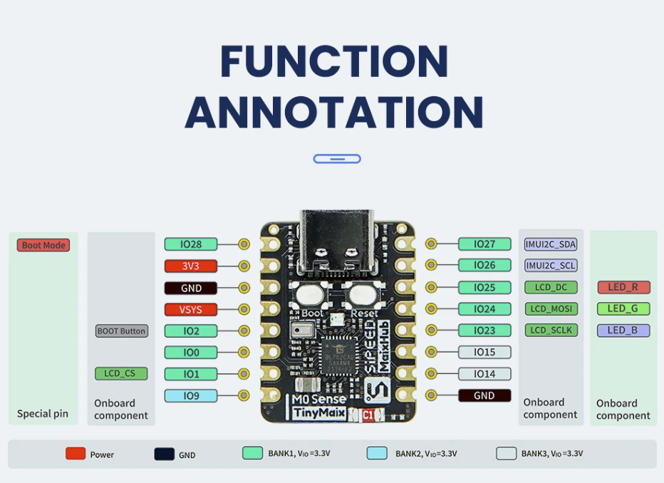

# **Guía rápida Tarjeta M0sense**
Esta implementación de Aixt que admite la tarjeta M0sense

## Vista
**M0sense, se conectan un total de 38 interfaces, por ejemplo, la tabla de definición de funciones de pin es la definición de la interfaz.**



## Datasheet
[M0sense](https://dl.sipeed.com/shareURL/Maix-Zero/M0sense/1_Specification)

## Identificación del puerto
Below are the ports used and their proper designations for programming:

No.| Nombre   | Función 
-- |-----     |---
1  |IO28      | GPIO28 
2  |3V3       | Fuente de alimentación de 3,3 V; Se recomienda que la corriente de salida de la fuente de alimentación externa sea superior a 500mA
3  |GND       | Tierra 
4  |VSYS      | REF System 
5  |I02       | GPI02/BOOT Button
6  |IO0       | GPIO0 
7  |IO1       | GPIO1_LCD_CS
8  |IO9       | GPIO9 
9  |IO27      | GPIO27_SDA
10 |IO26      | GPIO26_SCL 
11 |IO25      | GPIO25_LEDR_LCD_DC 
12 |IO24      | GPIO25_LEDG_LCD_MOSI 
13 |IO23      | GPIO25_LEDB_LCD_SCLK
14 |IO15      | GPIO15 
15 |IO14      | GPIO14 
16 |GND       | Tierra

## Programación en lenguaje v

### Configuración del puerto de salida

Para activar el puerto a utilizar
```v
pin.high(pin_name)
```
* *Ejemplo: Si desea activar el puerto IO17;  `pin.high(IO17)`.*

Para deshabilitar el puerto que se está utilizando
```v
pin.low(pin_name)
```
* *Ejemplo: Si desea deshabilitar el puerto IO17;  `pin.low(IO17)`.*

Para deshabilitar o habilitar el uso del puerto

```v
pin.write(pin_name, value)
```
* *Ejemplo: Si desea deshabilitar el puerto IO17 `pin.write(IO17, 1)`, y si desea activarlo  `pin.write(IO17, 0)`.*

### Detección del puerto de entrada

Si necesita saber en qué estado se encuentra un puerto de entrada:
```v
x = pin.read(pin_name)
```

* *Ejemplo: Si desea detectar el valor del puerto IO3; `x = pin.read(IO17)`, y `x` omará el valor de 0 o 1, dependiendo de qué puerto esté activo o deshabilitado.*

### Puertos Analógicos a Digitales (ADC)

Para configurar uno de los puertos analógicos
```v
adc.setup(channel, setup_value_1, ... )
```
* *En canal se ingresa el nombre del puerto analógico, en setup_value_1 el valor que se dará es dicho puerto.*

Para detectar el valor del puerto analógico
```v
x = adc.read(channel)
```
* *En `channel` el nombre del puerto analogico se ingresa, y `x` toma el valor de dicho puerto.*

## Modulación por ancho de pulso (salidas PWM)

Para configurar algún PWM
```v
pwm.setup(setup_value_1, setup_value_2, ... )
```
* *En pwm estableces el PWM a utilizar, y en setup_value_1 el valor al que quieres configurar dicho pwm.*


Para configurar el ciclo de trabajo de un modulador
```v
pwm_duty(duty)
```
* *En PWM se fija el pwm a utilizar, y en `duty` el valor del ciclo (de 0 a 100) en porcentaje.*

## Comunicación Serial (UART)

El UART solía ser la salida de flujo estándar, por lo que las funciones `print()`, `println()` y `input()` funcionan directamente en el UART predeterminado. El UART predeterminado puede variar según la placa o el microcontrolador; consulte la documentación específica. La sintaxis de la mayoría de las funciones UART es:  `uartx_function_name()`, donde `x` es el número de identificación en caso de múltiples UART. Puede omitir `x` para referirse al primer UART o al predeterminado, o en caso de tener solo uno.  

### Configuración UART

```v
uart.setup(baud_rate)   // the same of uart1_setup(baud_rate)
```
- `baud_rate` configurar la velocidad de comunicación

### Transmisión Serial
```v
print(message)      // print a string to the default UART
```
```v
println(message)    // print a string plus a line-new character to the default UART
```
```v
uart2_print(message)    // print a string to the UART2
```
```v
uart1_println(message)  // print a string plus a line-new character to the UART1
```
```v
uart2_write(message)    // send binary data (in Bytes) to UART2
```

### Retardos

* Uso de los tiempos

    * En cada expresión, el valor del tiempo se coloca dentro de los paréntesis.
```v
time.sleep(s) //Seconds
```
```v
time.sleep_ms(ms) //Milliseconds
```
```v
time.sleep_us(us) //Microseconds
```

* Ejemplo de LED parpadeante

```v
import machine { pin }
import time { sleep_ms }

pin_mode(IO14, out)

for {   //infinite loop
    pin.high(IO14)
    sleep_ms(500)
    pin.low(IO14)
    sleep_ms(500)
}
```