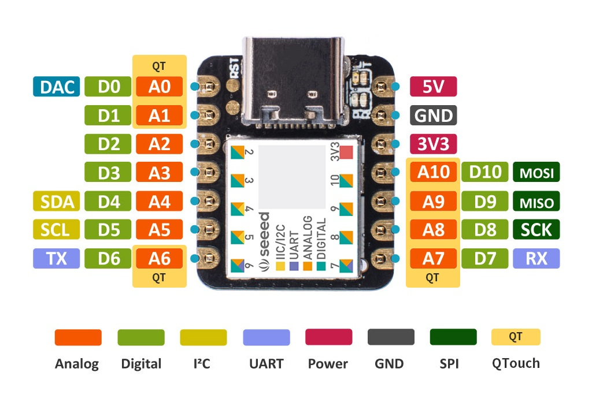
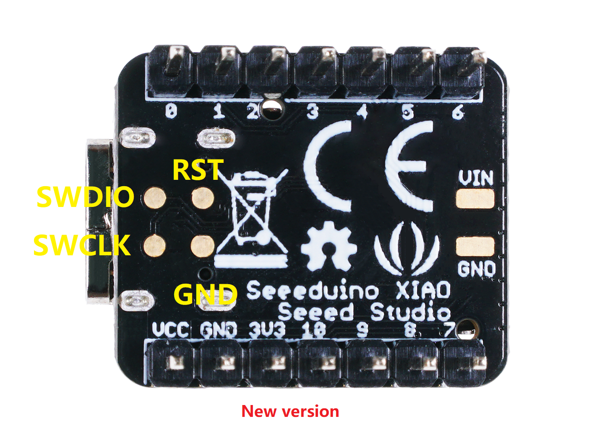

# **Guía rápida deSeeeduino Xiao**

Esta es una implementación de Aixt para brindar soporte a la tarjeta SAMD21.

## Resumen
* El SAMD21 cuenta con 14 pines que pueden utilizarse para 11 interfaces digitales, 11 interfaces simuladas, 10 interfaces PWM (d1-d10), 1 pin de salida DAC D0, 1 interfaz de almohadilla SWD, 1 interfaz I₂C, 1 interfaz SPI, 1 interfaz UART, indicador de comunicación serie (T/R) y luz intermitente (L) mediante multiplexación de pines. Los colores de los LED (Power, L, RX, TX) son verde, amarillo, azul y azul. Además, el SAMD21 de Seeed Studio XIAO cuenta con una interfaz tipo C que suministra energía y descarga código. Dispone de dos botones de reinicio que se pueden conectar brevemente para reiniciar la placa. La definición de los pines se describe en la tabla de identificación de pines.




***Getting Started with Seeed Studio XIAO SAMD21." (n.d.). Recuperado el 17 de febrero de 2024 de: https://wiki.seeedstudio.com/Seeeduino-XIAO/

## Datasheet
[Seeeduino Xiao SAMD21G18A-MU](https://files.seeedstudio.com/wiki/XIAOSeeed-Studio-XIAO-Series-SOM-Datasheet.pdf) 

## Identificación de Pin 

| Pin No. | Name                 | Function |
|---------|----------------------|----------|
| 0       | D0-A0-DAC-QT0        | Analógico; Digital; Convertidor analógico a digital; Circuito integrado con botón táctil capacitivo |
| 1       | D1-A1-QT1            | Circuito integrado de botón táctil capacitivo, analógico y digital |
| 2       | D2-A2                | Analógico; Digital |
| 3       | D3-A3                | Analógico; Digital |
| 4       | D4-A4-SDA(I2C)       | Protocolo analógico, digital e interintegrado (I2C) (transmisión de datos) |
| 5       | D5-A5-SCL(I2C)       | Protocolo analógico; digital; de circuitos integrados (I2C) (sincronización de reloj) |
| 6       | D6-A6-TX-QT2         | Circuito integrado de botón táctil capacitivo, analógico, digital y en serie (transmisor) |
| 7       | D7-A7-RX-QT3         | Circuito integrado de botón táctil capacitivo, analógico, digital y comunicación en serie (receptor) |
| 8       | D8-A8-SCK(SPI)-QT4   | Circuito integrado de botón táctil capacitivo analógico, digital, reloj en serie |
| 9       | D9-A9-MISO(SPI)-QT5  | Circuito integrado con botón táctil capacitivo, analógico, digital y protocolo de comunicación de 4 hilos |
| 10      | D10-A10-MOSI(SPI)-QT6| Circuito integrado con botón táctil capacitivo, analógico, digital y protocolo de comunicación de 4 hilos |
| 11      | 3.3V                 | Fuente de alimentación del microcontrolador |
| 12      | GND                  | Tierra |
| 13      | 5V                   | Fuente de alimentación de placa |


## Programación en lenguaje V

Las funciones contenidas en la API para entrada o salida digital y para realizar la conversión de analógico a digita

| Name                    | Description                                    | Examples                                 |
|-------------------------|------------------------------------------------|------------------------------------------|
| `pin.setup(pin, pin.mode)`  | Configure `pin` as `mode` (input, out)         | **pin.setup**(5, input) // Set pin 5 as input |
| `output`            | Parameter `mode` output configuration          | pin.setup(3, **output**) // Set pin 3 as output |
| `input`             | Parameter `mode` input configuration           | pin.setup(7, **input**) // Set pin 7 as input |
| `pin.high(pin)`         | Digital output high `pin`                      | **pin.high**(3) // Output high on pin 3 |
| `pin.low(pin)`          | Digital output low `pin`                       | **pin.low**(3) // Output low on pin 3 |
| `pin.write(pin, val)`   | Write `val` to `pin`                           | **pin.write**(3, 1) // Write 1 to pin 3 |
| `pin.read(pin)`         | Digital read `pin`                             | val=**pin.read**(3) // Read pin 3 and store in val |
| `adc.read(pin)`         | Analog read `pin` for `adc`                    | val=**adc.read**(3) // Read analog value of pin 3 and store in val |
| `pwm.write(pin, val)`   | PWM output `pin` with duty cycle `val`         | **pwm.write**(4, 125) // Write PWM signal with duty cycle of 125 to pin 3 |
| `uart.setup(baud_rate)` | Serial Communication initiation at `Baud.rate` | **uart.setup**(9600) // Initialize serial communication at 9600 baud rate |
| `uart.any()`            | Get the number of bytes to read                | val=**uart.any()** // Get the number of bytes to read from serial port and store in val |
| `uart.read()`           | Serial Communication read                      | lec=**uart.read()** // Read from serial port and store in lec |
| `uart.println("message")`| Print `message` through Serial Communication  | **uart.println**("Hello world") // Print "Hello world" through serial port |
`time.sleep(time)`        | Retardo en `seg`                                |**time.sleep**(5) // **5** seconds delay
`time.sleep_us(time)`     | Retardo en `microseg`                           |**time.sleep_us**(250) // **250** microseconds delay
`time.sleep_ms(time)`     | Retardo en `miliseg`                            |**time.sleep_ms**(250) // **250** milliseconds delay

## EJEMPLOS

###Ejemplo de transcompilación y compilación en YouTube.


<div style="text-align: center;" markdown="1">
  <iframe width="960" height="540" src="https://www.youtube.com/embed/Wi4j1mvfa_0?si=L1jLUJqPxOC4kTvd" title="YouTube video player" frameborder="0" allow="accelerometer; autoplay; clipboard-write; encrypted-media; gyroscope; picture-in-picture; web-share" referrerpolicy="strict-origin-when-cross-origin" allowfullscreen></iframe>
</div>


### LED Parpadeante
A continuación, un LED se encenderá y apagará 10 veces.

```v
import time {sleep_ms}   // Import the sleep_ms function from the time module 
import pin  // Import the pin module in its entirety

pin.mode(5, pin.output)    // Set pin #5 as output

for i in 0..10{   // 10 times
    pin.high(5)     // Output high (Turn on the LED)
    sleep_ms(500)   // Delay for 0.5s
    pin.low(5)      // Output low (Turn off the LED)
    sleep_ms(500)   // Delay for 0.5s
}
for{}       // Infinite loop necessary for compilation
```

### Secuencia de 3 LEDs
A continuación, se mostrará una secuencia de 3 LEDs.

```v
import time {sleep_ms} // Import the sleep_ms function
import pin  // Import the pin module

pin.setup(3, pin.output)    // Set pin #3 as output
pin.setup(4, pin.output)    // Set pin #4 as output
pin.setup(5, pin.output)    // Set pin #5 as output

for{
    pin.high(3)     // Output high
    sleep_ms(250)   // Delay for 250 milliseconds
    pin.high(4)     // Output high
    sleep_ms(250)   // Delay for 250 milliseconds
    pin.high(5)     // Output high
    sleep_ms(250)   // Delay for 250 milliseconds
    pin.low(3)      // Output low
    sleep_ms(250)   // Delay for 250 milliseconds
    pin.low(4)      // Output low
    sleep_ms(250)   // Delay for 250 milliseconds
    pin.low(5)      // Output low
    sleep_ms(250)   // Delay for 250 milliseconds
}
```

### Encender un LED con un botón
A continuación el encendido de un LED quedará condicionado a un botón.

```v
import pin  // Import the pin module

__global (
    reading = 0      // Create a global variable to store digital reading
)    

pin.setup(3, pin.input)     // Set pin #3 as input
pin.setup(5, pin.output)       // Set pin #5 as output

for{        // Infinite loop
    reading=pin.read(3)     // Store digital reading of pin #3
    if reading==1{         // Condition if reading value is 1 (High)
        pin.high(5);        // Output high
    }
    pin.low(5)              // Output low 
}
```


### Lectura Analógica

```v
import pin  // import the pin module
import adc  // import the adc module

__global (
    val = 0      // Create a global variable to store the analog reading
)     
pin.setup(2, pin.output)   // Set pin #2 as output
pin.setup(3, pin.output)   // Set pin #3 as output
pin.setup(4, pin.output)   // Set pin #4 as output


for {       // Infinite loop
    val = adc.read(8)     // Store the analog reading of pin #8
    if val >= 1000 {      // Condition for the analog reading
        pin.high(2)     // Output high
        pin.high(3)     // Output high
        pin.high(4)     // Output high
    }
    else if val >= 750 {
        pin.high(2)     // Output high
        pin.high(3)     // Output high
        pin.low(4)      // Output low
    }
    else if val >= 480 {
        pin.high(2)     // Output high
        pin.low(3)      // Output low
        pin.low(4)      // Output low
    }
    else {
        pin.low(2)      // Output low
        pin.low(3)      // Output low
        pin.low(4)      // Output low  
    }   
    }
```

### Salida PWM

```v
import time {sleep_ms}  // import the sleep_ms function
import pin              // import the pin module
import pwm              // import the pwm module

__global (
    val = 0        // Create a global variable to store a value corresponding to the luminous intensity
)      

pin.setup(5, pin.output)   // Set pin #5 as output


for {
    pwm.write(5, val)   // PWM output with a duty cycle of val
    sleep_ms(250)       // Delay of 250ms
    val = val + 10      // Add 10 to val
    if val == 250 {     // Condition if val equals 250
		val = 0  
    }
} 
```

### Comunicación del Serial 

```v
import pin      // import the pin module
import uart     // import the uart module
 
 __global (
    num = 0    // Create a global variable to store the number of bytes to read from the serial port
    lec = 0    // Create a global variable to store the reading from the serial port
 )

 pin.setup(3, pin.output)      // Set pin #3 as output
 uart.setup(9600)           // Set the baud rate to 9600

for {
    num = uart.any()      // Store the number of bytes to read from the serial port
    if  num > 0  {          // Condition if the number of bytes to read is greater than 0
        lec = uart.read()   // Store the reading from the serial port
        if lec == `1` {     // Condition when the reading is 1

            pin.high(3)     // Output high
            uart.println('Led on')   // Message on the serial port

        }

        else if lec == `2` {    // Condition when the reading is 2

            pin.low(3)      // Output low
            uart.println('Led off')     // Message on the serial port

        }
    }
}
```
 
