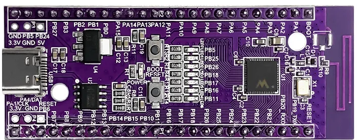
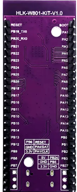
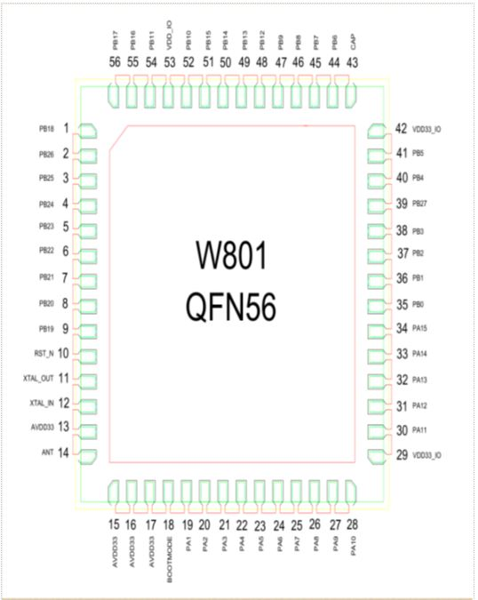

# **Fast guide W801**
Esta implementación de Aixt que admite la tarjeta W801

## Vista
**W801, se conectan un total de 44 interfaces, por ejemplo, la tabla de definición de función de pin es la definición de interfaz.**







*Imagenes tomadas de la hoja de datos del dispositivo.*

## Datasheet  
[W801](https://ssdielect.com/wifi-sistemas-de-desarrollo-esp8266-wifi/3954-hlk-w801-kit.html)

## Identificación del puerto
A continuación se muestran los puertos utilizados y sus designaciones adecuadas para la programación:

No.| Name     | Function 
-- |-----     |---
1  |PB_18     | GPIO, entrada, alta impedancia  UART5_TX/LCD_SEG30
2  |PB_26     | GPIO, entrada, alta impedancia  LSPI_MOSI/PWM4/LCD_SEG1
3  |PB_25     | GPIO, entrada, alta impedancia  LSPI_MISO/PWM3/LCD_COM0
4  |PB_24     | GPIO, entrada, alta impedancia  LSPI_CK/PWM2/LCD_SEG2
5  |PB_23     | GPIO, entrada, alta impedancia  LSPI_CS/PCM_DATA/LCD_SEG0
6  |PB_22     | GPIO, entrada, alta impedancia	UART0_CTS/PCM_CK/LCD_COM2 
7  |PB_21     | GPIO, entrada, alta impedancia	UART0_RTS/PCM_SYNC/LCD_COM1 
8  |PB_20     | UART_RX 	UART0_RX/PWM1/UART1_CTS/I2C_SCL 
9  |PB_19     | UART_TX 	UART0_TX/PWM0/UART1_RTS/I2C_SDA 
10 |RESET     | REINICIAR restablecer
11 |XTAL_OUT  | Salida de oscilador de cristal externo
12 |XTAL_IN   | Entrada de oscilador de cristal externo
13 |AVDD33    | Fuente de alimentación del chip, 3,3 V.
14 |ANT       | antena de radiofrecuencia
15 |AVDD33    | Fuente de alimentación del chip, 3,3 V.
16 |AVDD33    | Fuente de alimentación del chip, 3,3 V.
17 |AVDD33_AUX| Fuente de alimentación del chip, 3,3 V.
18 |BOOTMODE  | EL MODO DE INICIO	I2S_MCLK/LSPI_CS/PWM2/I2S_DO 
19 |PA_1      | JTAG_CK	JTAG_CK/I2C_SCL/PWM3/I2S_LRCK/ADC_1 
20 |PA_2      | GPIO, entrada, alta impedancia	UART1_RTS/UART2_TX/PWM0/UART3_RTS/ADC_4 
21 |PA_3      | GPIO, entrada, alta impedancia	UART1_CTS/UART2_RX/PWM1/UART3_CTS/ADC_3 
22 |PA_4      | JTAG_SWO 	JTAG_SWO/I2C_SDA/PWM4/I2S_BCK/AD C_2 
23 |PA_5      | GPIO, entrada, alta impedancia	UART3_TX/UART2_RTS/PWM_BREAK/UART4_RTS/VRP_EXT
24 |PA_6      | GPIO, entrada, alta impedancia	UART3_RX/UART2_CTS/NULL/UART4_CTS/LCD_SEG31/VRP_EXT
25 |PA_7      | GPIO, entrada, alta impedancia	PWM4/LSPI_MOSI/I2S_MCK/I2S_DI/LC D_SEG3/Touch_1
26 |PA_8      | GPIO, entrada, alta impedancia	PWM_BREAK/UART4_TX/UART5_TX/I2S_ BCLK/LCD_SEG4
27 |PA_9      | GPIO, entrada, alta impedancia	MMC_CLK/UART4_RX/UART5_RX/I2S_LRCLK/LCD_SEG5/TOUCH_2
28 |PA_10     | GPIO, entrada, alta impedancia	MMC_CMD/UART4_RTS/PWM0/I2S_DO/LCD_SEG6/TOUCH_3 
29 |VDD33IO   | Fuente de alimentación IO, 3,3 V
30 |PA_11     | GPIO, entrada, alta impedancia	MMC_DAT0/UART4_CTS/PWM1/I2S_DI/L CD_SEG7 
31 |PA_12     | GPIO, entrada, alta impedancia	MMC_DAT1/UART5_TX/PWM2/LCD_SEG8/ TOUCH_14 
32 |PA_13     | GPIO, entrada, alta impedancia	MMC_DAT2/UART5_RX/PWM3/LCD_SEG9 
33 |PA_14     | GPIO, entrada, alta impedancia	MMC_DAT3/UART5_CTS/PWM4/LCD_SEG1 0/TOUCH_15 
34 |PA_15     | GPIO, entrada, alta impedancia	PSRAM_CK/UART5_RTS/PWM_BREAK/LCD _SEG11 
35 |PB_0      | GPIO, entrada, alta impedancia	PWM0/LSPI_MISO/UART3_TX/PSRAM_CK /LCD_SEG12/Touch_4
36 |PB_1      | GPIO, entrada, alta impedancia	PWM1/LSPI_CK/UART3_RX/PSRAM_CS/L CD_SEG13/Touch_5
37 |PB_2      | GPIO, entrada, alta impedancia	PWM2/LSPI_CK/UART2_TX/PSRAM_D0/L CD_SEG14/Touch_6
38 |PB_3      | GPIO, entrada, alta impedancia	PWM3/LSPI_MISO/UART2_RX/PSRAM_D1 /LCD_SEG15/Touch_7
39 |PB_27     | GPIO, entrada, alta impedancia	PSRAM_CS/UART0_TX/LCD_COM3 
40 |PB_4      | GPIO, entrada, alta impedancia	LSPI_CS/UART2_RTS/UART4_TX/PSRAM_D2/LCD_SEG16/Touch_8
41 |PB_5      | GPIO, entrada, alta impedancia	LSPI_MOSI/UART2_CTS/UART4_RX/PSARM_D3/LCD_SEG17/Touch_9
42 |VDD33IO   | Fuente de alimentación IO, 3,3 V
43 |CAP       | Condensador externo, 1 µF
44 |PB_6      | GPIO, entrada, alta impedancia	UART1_TX/MMC_CLK/HSPI_CK/SDIO_CK /LCD_SEG18/Touch_10 
45 |PB_7      | GPIO, entrada, alta impedancia	UART1_RX/MMC_CMD/HSPI_INT/SDIO_C MD/LCD_SEG19/Touch_11 
46 |PB_8      | GPIO, entrada, alta impedancia	I2S_BCK/MMC_D0/PWM_BREAK/SDIO_D0 /LCD_SEG20/Touch_12
47 |PB_9      | GPIO, entrada, alta impedancia	I2S_LRCK/MMC_D1/HSPI_CS/SDIO_D1/ LCD_SEG21/Touch_13
48 |PB_12     | GPIO, entrada, alta impedancia	HSPI_CK/PWM0/UART5_CTS/I2S_BCLK/ LCD_SEG24 
49 |PB_13     | GPIO, entrada, alta impedancia	HSPI_INT/PWM1/UART5_RTS/I2S_LRCL K/LCD_SEG25 
50 |PB_14     | GPIO, entrada, alta impedancia	HSPI_CS/PWM2/LSPI_CS/I2S_DO/LCD_ SEG26 
51 |PB_15     | GPIO, entrada, alta impedancia	HSPI_DI/PWM3/LSPI_CK/I2S_DI/LCD_ SEG27 
52 |PB_10     | GPIO, entrada, alta impedancia	I2S_DI/MMC_D2/HSPI_DI/SDIO_D2/LC D_SEG22 
53 |VDD33IO   | Fuente de alimentación IO, 3,3 V
54 |PB_11     | GPIO, entrada, alta impedancia	I2S_DO/MMC_D3/HSPI_DO/SDIO_D3/LCD_SEG23 
55 |PB_16     | GPIO, entrada, alta impedancia	HSPI_DO/PWM4/LSPI_MISO/UART1_RX/LCD_SEG28 
56 |PB_17     | GPIO, entrada, alta impedancia	UART5_RX/PWM_BREAK/LSPI_MOSI/I2S_MCLK/LCD_SEG29
   |5V        | INPUT 5V W801
   |GND       | GROUND CARD W801
   |3.3V      | INPUT 3.3V W801


### ADC

El módulo de adquisición basado en Sigma-Delta ADC completa la adquisición de hasta 4 señales analógicas. La frecuencia de muestreo se controla mediante un reloj de entrada externo. Puede recopilar el voltaje de entrada y la temperatura del chip, y admite calibración de entrada y calibración de compensación de temperatura. 

#### Ejemplo:

#include "Arduino.h"
/*
 * Ejemplo de lectura analógica HLK-W80x.
 * 
 * Las tarjetas W80x tienen cuatro puertos analógicos.
 * Puedes acceder desde el código Arduino mediante los pines PA1-PA4
 * o por nombres cortos A1-A4.
 * 
 * El nombre A0 es un alias de A1, agregado por compatibilidad.
 * 
 */
 int a1=PA4;
 int a2=PB0;
 int a3=PB1;


void setup()
{
pinMode(a1,ANALOG_INPUT);  
pinMode(a2,OUTPUT);
pinMode(a3,OUTPUT);  

digitalWrite(a2,LOW);
digitalWrite(a3,LOW);


}
void loop()
{
if (250>=analogRead(a1)){
digitalWrite(a2,HIGH);
digitalWrite(a3,LOW);
}
else {
digitalWrite(a2,LOW);
digitalWrite(a3,HIGH);
}

}

### PWM
Función de generación de señal PWM de 5 canales 

Función de captura de señal de entrada de 2 canales (PWM0 y PWM4 dos canales) 

Rango de frecuencia: 3Hz ~ 160KHz 

Precisión máxima del ciclo de trabajo: 1/256, ancho del contador insertado en la zona muerta: 8 bits 

#### Ejemplo:

#include <Arduino.h>

#define DUTY_MAX 240
#define DUTY_MIN 50

// Nota: en la tarjeta W801 solo dos LED están conectados a los pines PWM, por lo que el LED PB5 no se encenderá

int m[3] = { 0 }, d[3] = { DUTY_MIN, (DUTY_MIN + DUTY_MAX) / 2, DUTY_MAX - 1 };

int pwm_pin[3] = { LED_BUILTIN_1, LED_BUILTIN_2, LED_BUILTIN_3 };

void setup() {
  for (int i = 0; i < 3; i++) pinMode(pwm_pin[i], PWM_OUT);
}

void loop() {

  for (int i = 0; i < 3; i++) {
    if (m[i] == 0)  // Increasing
    {
      analogWrite(pwm_pin[i], d[i]++);
      if (d[i] == DUTY_MAX) m[i] = 1;
    } else  // Decreasing
    {
      analogWrite(pwm_pin[i], d[i]--);
      if (d[i] == DUTY_MIN) m[i] = 0;
    }
  }
delay(5);  
}

### Comunicación UART

El lado del dispositivo cumple con el protocolo de interfaz de bus APB 

Admite modo de trabajo de interrupción o sondeo 

Admite el modo de transferencia DMA, existe FIFO de 32 bytes para enviar y recibir 

Velocidad de baudios programable 

Longitud de datos de 5-8 bits y paridad configurable 

1 o 2 bits de parada configurables 

Admite control de flujo RTS/CTS 

Admite envío y recepción de fotogramas interrumpidos 

Desbordamiento, error de paridad, error de trama, indicación de interrupción de trama de ruptura de recepción 

Operación DMA de 16 bytes en ráfaga como máximo 

#### Ejemplo:

const int pin1 = PB21;
const int pin2 = PB22;

void setup() {
  Serial.begin(115200);
  pinMode(pin1, pin.OUTput);
  pinMode(pin2, pin.OUTput);
}
void loop() {
 	Serial.println("\r\n Comunicacion UART tarjeta W801-PC:");
	Serial.println("\r\n Oprimiendo la letra Q, activa la salida  del pin1.");

  if (Serial.available() > 0) {
    char command = Serial.read();

    switch(command) {  
       case 'Q':
         digitalWrite(pin1, HIGH);
         delay(4000); 
         digitalWrite(pin1, LOW);
         delay(1000);
	break;

       default:
          digitalWrite(pin2, HIGH);
          delay(4000);
          digitalWrite(pin2, LOW);
          delay(1000); 
        break;
    }
  }
}

## Programación en lenguaje v
Para cada uno de estos módulos, tendrás un archivo en formato .cv con el mismo nombre del módulo y en este tendrás el texto módulo seguido del nombre del módulo, ejemplo:
* module pin
* module adc
* module pwm


### Configuración del puerto de salida
Para activar el puerto a utilizar
```v
pin.setup(pin_name, mode)
```
Para activar el puerto a utilizar
```v
pin.high(PIN_NAME)
```
* *Ejemplo: Si desea activar el puerto 17;  `pin.high(17)`.*

Para deshabilitar el puerto que se está utilizando
```v
pin.low(PIN_NAME)
```
* *Ejemplo: Si desea deshabilitar el puerto 17;  `pin.low(17)`.*

Para deshabilitar o habilitar el uso del puerto

```v
pin.write(PIN_NAME, VALUE)
```
* *Ejemplo: Si desea deshabilitar el puerto 17 `pin.write(17, 1)`, y si desea activarlo  `pin.write(17, 0)`.*


### Puertos analógicos a digitales (ADC)

Para configurar uno de los puertos analógicos
```v
adc.setup(PIN_NAME, SETUP_VALUE, ... )
```
* *En PIN_NAME se ingresa el nombre del puerto analógico, en SETUP_VALUE el VALOR que se dará es dicho puerto.*

Para detectar el VALOR del puerto analógico
```v
x = adc.read(PIN_NAME)
```
* *En `PIN_NAME` el nombre del puerto analogico se ingresa, y `x` toma el VALOR de dicho puerto.*

## Modulación por ancho de pulso (salidas PWM)

Para configurar algún PWM
```v
pwm.setup(SETUP_VALUE, setup_VALUE_1, ... )
```
* *En pwm estableces el PWM a utilizar, y en SETUP_VALUE el VALOR al que quieres configurar dicho pwm.*


Para configurar el ciclo de trabajo de un modulador
```v
pwm.write(duty)
```
* *En PWM se fija el pwm a utilizar, y en `duty` el VALOR del ciclo (de 0 a 100) en porcentaje.*

## Comunicación Serial (UART)

El UART solía ser la salida de flujo estándar, por lo que las funciones `print()`, `println()` y `input()` funcionan directamente en el UART predeterminado. El UART predeterminado puede variar según la placa o el microcontrolador; consulte la documentación específica. La sintaxis de la mayoría de las funciones UART es: `uart_function_name_x()`, que es `x` el número de identificación en caso de múltiples UART. Puede omitir `x` para referirse al primer UART o al predeterminado, o en caso de tener solo uno.  

### Configuración de UART 

```v
uart.setup(BAUD_RATE)   // the same of uart.setup(BAUD_RATE)
```
Para una segunda conexión se utiliza como:
```v 
uart.setup_1(BAUD_RATE)   // the same of uart.setup_1(BAUD_RATE)
```
- `BAUD_RATE` configurar la velocidad de comunicación
### Transmisión del Serial

```v
uart.print(message)      // print a string to the default UART
```
```v
uart.println(message)    // print a string plus a line-new character to the default UART
```
```v
uart.ready // get everything ready for to UART
```
```v
uart.read // receives binary data (in Bytes) to UART
```
```v
uart.write(MESSAGE)    // send binary data (in Bytes) to second UART
```
- Para un segundo UART se utilizaría de la siguiente manera:
```v
uart.print_1(MESSAGE)    // print a string to the second UART
```
```v
uart.println_1(MESSAGE)  // print a string plus a line-new character to the second UART
```
```v
uart.write_1(MESSAGE)    // send binary data (in Bytes) to second UART
```
```v
uart.ready_1 // get everything ready for to second UART
```
```v
uart.read_1 // receives binary data (in Bytes) to second UART
```

### Retardos

* Uso de los tiempos

    * En cada expresión, el VALOR del tiempo se coloca dentro de los paréntesis.
```v
time.sleep(S) //Seconds
```
```v
time.sleep_ms(MS) //Milliseconds
```
```v
time.sleep_us(US) //Microseconds
```

* Ejemplo de LED parpadeante

```v
import pin
import time {sleep_ms}

pin.setup(14, pin.output)

for {   //infinite loop
    pin.high(14)
    sleep_ms(500)
    pin.low(14)
    sleep_ms(500)
}
```