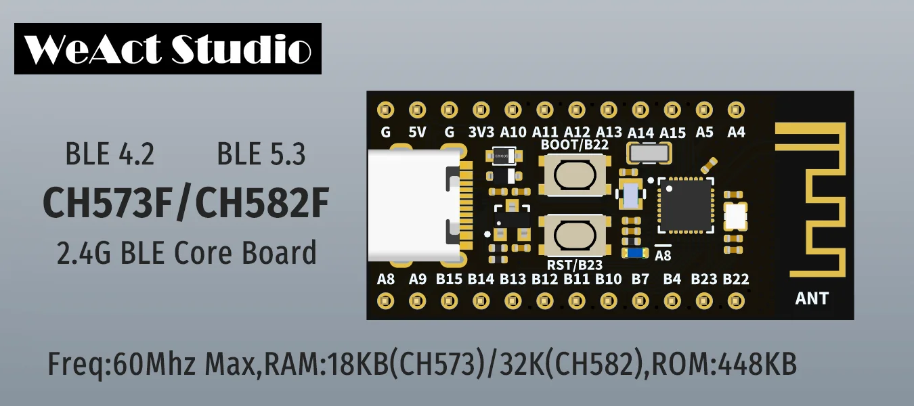

# **Guía rápida CH573F-mini-BLE**
Esta implementación de Aixt que admite la tarjeta CH573F-mini-BLE

## Vista
CH573F-mini-BLE, Es una tarjeta con comunicación Bluetooth 4.2, que cuenta con un total de 24 pines divididos en dos puertos, A y B, con una velocidad de 60 MHz, 18 kB de RAM, 448 kB de ROM, con conexión a través de USB tipo C. Incluye funciones de salida, entrada, PWM, ADC y UART.



*Imagen tomada del dispositivo* [Image_CH573F-mini-BLE](https://github.com/WeActStudio/WeActStudio.WCH-BLE-Core/blob/master/Images/1.png)

## Datasheet
[CH573F-mini-BLE](https://github.com/WeActStudio/WeActStudio.WCH-BLE-Core/blob/master/Doc/CH573/en/CH573DS1.PDF)

## Identificación del puerto
A continuación se muestran los puertos utilizados y sus designaciones adecuadas para la programación:

Nombre| Función alternativa | Descripción
---   |       :---:         |     ---
G     |                     | Tierra
5V    |                     | Fuente de alimentación de 5 V 
G     |                     | Tierra
3V3   |                     | Fuente de alimentación de 3,3 V 
A4    |        I/0          | Pin de I/0 digital bidireccional de propósito general
|     |        RXD3         | Entrada de datos en serie UART3
A5    |        I/0          | Pin de I/0 digital bidireccional de propósito general
|     |        TXD3         | Salida de datos en serie UART3
A8    |        I/0          | Pin de I/0 digital bidireccional de propósito general
|     |        RXD1         | Entrada de datos en serie UART1
A9    |        I/0          | Pin de I/0 digital bidireccional de propósito generaln
|     |        TXD1         | Salida de datos en serie UART1t
A10   |        I/0          | Pin de I/0 digital bidireccional de propósito general
A11   |        I/0          | Pin de I/0 digital bidireccional de propósito general
A12   |        I/0          | Pin de I/0 digital bidireccional de propósito general
|     |        PWM4         | Canal de salida de modulación de ancho de pulso 4
A13   |        I/0          | Pin de I/0 digital bidireccional de propósito general
|     |        PWM5         | Canal de salida de modulación de ancho de pulso 5
A14   |        I/0          | Pin de I/0 digital bidireccional de propósito general
A15   |        I/0          | Pin de I/0 digital bidireccional de propósito general 
B4    |        I/0          | Pin de I/0 digital bidireccional de propósito general
|     |        RXD0         | Entrada de datos en serie UART0
|     |        PWM7         | Canal de salida de modulación de ancho de pulso 7
B7    |        I/0          | Pin de I/0 digital bidireccional de propósito general
|     |        TXD0         | Salida de datos en serie UART0
|     |        PWM9         | Canal de salida de modulación de ancho de pulso 9            
B10   |        I/0          | Pin de I/0 digital bidireccional de propósito general
B11   |        I/0          | Pin de I/0 digital bidireccional de propósito general 
B12   |        I/0          | Pin de I/0 digital bidireccional de propósito general
B13   |        I/0          | Pin de I/0 digital bidireccional de propósito general
B14   |        I/0          | Pin de I/0 digital bidireccional de propósito general
|     |        PWM10        | Canal de salida de modulación de ancho de pulso 10
B15   |        I/0          | Pin de I/0 digital bidireccional de propósito general 
B22   |        I/0          | Pin de I/0 digital bidireccional de propósito general
|     |        RXD2         | Entrada de datos en serie UART2
B23   |        I/0          | Pin de I/0 digital bidireccional de propósito general
|     |        TXD2         | Salida de datos en serie UART2
|     |        PWM11        | Canal de salida de modulación de ancho de pulso 11

## Programación en lenguaje C/C++  
La tarjeta CH573-mini-BLE se programa con [MounRiver Studio](http://www.mounriver.com/download), desarrollado con base en la versión Eclipse GNU. Está optimizado para el desarrollo integrado de C/C++ para microcontroladores ARM y RISC-V, este último presente en la tarjeta CH573-mini-BLE..  

## Programación en lenguaje v  
La distribución se realizará por módulos dentro de la API, según las funciones que se implementarán en la tarjeta CH573F-miniBLE. Los módulos tendrán una configuración específica en el archivo interno creado con el nombre de cada módulo con la extensión .cv y otros archivos de configuración dentro del módulo para la correcta configuración de cada función. Los módulos para la tarjeta CH573-mini-BLE son los siguientes:

* Module adc
* Module pin
* Module port
* Module pwm
* Module time
* Module uart

### Configuración del pin de configuración
Para configurar el modo de uso del PIN.

```v
pin.setup(pin_name, mode)
```
* *Ejemplo: Si desea activar el pin 11 del puerto A como salida;  `pin.setup(pin.a11, pin.output)`.*
* *Ejemplo: Si desea activar el pin 11 del puerto A como entrada.;  `pin.setup(pin.a11, pin.input)`.*

Para activar el pin a utilizar
```v
pin.high(PIN_NAME)
```
* *Ejemplo: Si desea activar el pin 7 del puerto B;  `pin.high(pin.b7)`.*

Para deshabilitar el PIN que se está utilizando
```v
pin.low(PIN_NAME)
```
* *Ejemplo: Si desea deshabilitar el pin 7 del puerto B;  `pin.low(pin.b7)`.*

### Configuración del puerto de instalación
Para configurar el modo de uno o todos los pines del puerto específico.
```v
port.setup(PORT, BITS, MODE)
```
* *Ejemplo: Si desea activar el pin 4 del puerto A como salida;  `pin.setup(pin.a, pin.0x00000010, output)`.*
* *Ejemplo: Si desea activar todos los pines del puerto B como entradas;  `pin.setup(pin.b, pin.0xFFFFFFFF, input)`.*

Detección de puerto estatal

Si necesita saber en qué estado se encuentra un puerto de entrada:
```v
pin.read(PORT)
```
* *Ejemplo: Si desea detectar el VALOR del puerto A; `port.read(port.a)`*

Para activar un pin o usar todos los pin
```v
port.write(PORT, BITS)
```
* *Ejemplo: Si desea activar el pin 15 del puerto B como salida;  `port.write(port.b, 0x00000080)`.*
* *Ejemplo: Si desea activar todos los pines del puerto B;  `port.write(port.a, 0xFFFFFFFF)`.*

### Modulación por ancho de pulso (salidas PWM)

Hay 6 canales PWM en la tarjeta CH573-mini-BLE, cada canal tiene su pin respectivo para la configuración de salida. 

Para la configuración de salida PWM:
```v
pwm.write(channel, value)
```
* *Ejemplo: Si desea activar pwm el canal 4 con un valor específico entre un ciclo de 0 y 256;  `pwm.write(4, 50)`*

### Comunicación Serial (UART)

Para la comunicación serie, la tarjeta CH573-mini-BLE cuenta con cuatro puertos UART, cada uno con dos pines para enviar y recibir datos (TX y RX, respectivamente). Para la comunicación serie, se requiere un cable USB-TTL con su controlador correspondiente.

Debido a que hay cuatro puertos de comunicación serial UART, la configuración en la API se crea para cada UART, estableciendo UART, UART1, UART2 y UART3.

Para configurar la velocidad de comunicación serial UART:
```
uart#.setup(baud_rate)
```
- `baud_rate` para configurar la velocidad de comunicación serial.
* *Ejemplo: Si desea establecer una velocidad en UART0, utilice `uart0.setup(115200)`*

### Transmisión Serial 

```v
uart#.print(message)      // print a string to the default UART
```
* *Ejemplo: Si desea utilizar el puerto UART0 `uart0.print(Uart for AIXT)`*
```v
uart#.println(message)    // print a string plus a line-new character to the default UART
```
* *Ejemplo: Si desea utilizar el puerto UART1 `uart1.println(Command received)`*
```v
uart#.write(message)    // send binary data (in Bytes) to the default UART
```
* *Ejemplo: Si desea utilizar el puerto UART2 `uart2.write()`*
```v
uart#.read // receives binary data (in Bytes) to the default UART 
```
* *Ejemplo: Si desea utilizar el puerto UART3 `uart3.read()`*

### Tiempo 

* En cada expresión, el VALOR del tiempo se coloca dentro de los paréntesis.
```v
time.sleep(s) //Seconds
```
* *Ejemplo: Esto se utiliza como `time.sleep(2)`*
```v
time.sleep_ms(ms) //Milliseconds
```
* *Ejemplo: Esto se utiliza como `time.sleep_ms(500)`*
```v
time.sleep_us(us) //Microseconds
```
 *Ejemplo: Esto se utiliza como `time.sleep_us(5000)`*

## Implementación del proyecto AIXT

A continuación se muestran algunos códigos en lenguaje V, ejemplos de las principales funciones que se transcompilan para obtener el código en lenguaje C/C++ y realizar la carga a la tarjeta CH573F-mini-BLE a través de la extensión WCHISPTool del programa MounRiver. 

* Ejemplo de LED parpadeante

```v
import time { sleep_ms }
import pin 

pin.setup(pin.a8, pin.output)

for {
    pin.high(pin.a8)    
    sleep_ms(150)
    pin.low(pin.a8)
    sleep_ms(150)
}
```

* Ejemplo de LED intermitente con interruptor 

```v
import time { sleep_ms }
import pin 

pin.setup(pin.a8, pin.output)

for {
    pin.toggle(pin.a8)    
    sleep_ms(150)
}
```
* Ejemplo PUERTO 
```v
import port
import time {sleep_ms}

port.setup(port.a, pin.0x00000800, port.output)
port.setup(port.b, pin.0xFFFFFFFF, port.output)
for{
	port.write(port.a,0x00000800)
	time.sleep_ms(1000)
	port.write(port.b,0x00000800)
	time.sleep_ms(1000)
}
```
* Ejemplo PWM
```v
import time { sleep_ms }
import pin { setup }                         
import pwm                           

pin.setup(pin.a12, pin.output) 

value := 50

for {
    pwm.write(4, value)
    value = value + 50
    sleep_ms(300)
    if value > 250 {
        pwm.off(4)  
        sleep_ms(300)
        value = 50 
    }
}
```
* Ejemplo ADC
```v
import pin { setup }                         
import pwm      
import adc

pin.setup(pin.a4, pin.input) 

adc.setup(0)

for {
    adc.read(value)
	pwm.write(4, value)
    }
```
* Ejemplo UART0
```v
import time {sleep_ms}
import uart
import pin 

pin.high(pin.b7)
pin.setup(pin.b4, in_pullup) 
pin.setup(pin.b7, pin.output)

uart.setup(115200)

for {
    uart.write(TxBuff)
    sleep_ms(2000)
	uart.read()
}
```
