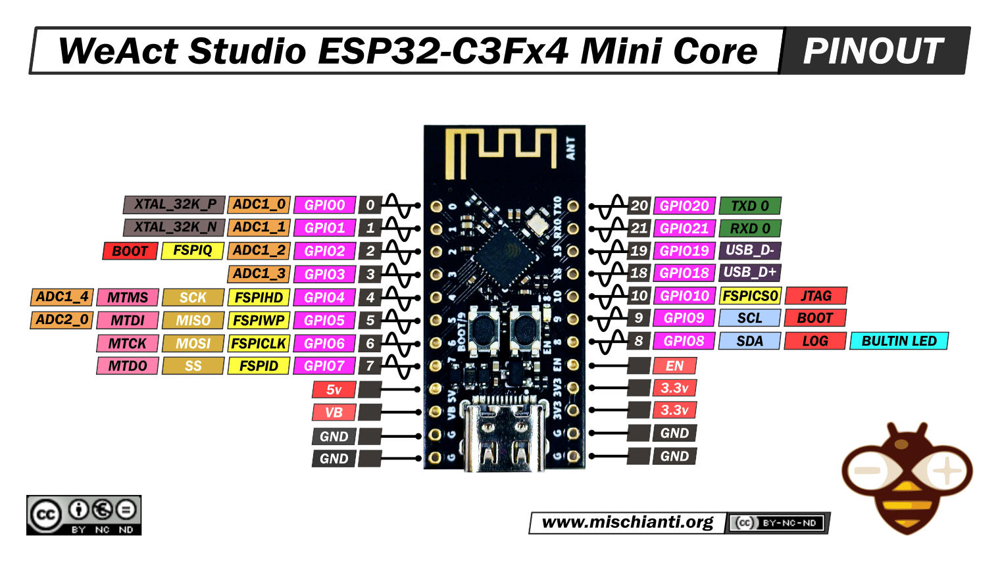

#  **GUÍA RÁPIDA ESP32-C3FH4**

Esta es una implementación de Aixt para brindar soporte a la tarjeta ESP32-C3FH4 board.

## SUMMARY

* El ESP32C3FH4 de WeAct Studio es una tarjeta de desarrollo basada en el microcontrolador ESP32-C3FH4 de Espressif Systems. Este microcontrolador forma parte de la familia ESP32 de Espressif, conocida por su conectividad Wi-Fi y Bluetooth de bajo consumo.

* El ESP32-C3FH4 es un microcontrolador económico y de bajo consumo. Se basa en una arquitectura de procesador RISC-V de 32 bits y cuenta con conectividad Wi-Fi de modo dual y tecnología Bluetooth integrada.

* WeAct Studio es un fabricante de tarjetas de desarrollo y módulos electrónicos. La tarjeta de desarrollo ESP32C3FH4 de WeAct Studio proporciona un entorno práctico para trabajar con el microcontrolador ESP32-C3FH4. Generalmente incluye características como puertos de entrada/salida, conectores de antena, interfaces de programación y funciones de depuración, entre otras.

## FUNCIÓN
* Las funciones del ESP32C3FH4 de WeAct Studio están determinadas tanto por las capacidades del microcontrolador ESP32-C3FH4 como por las características adicionales proporcionadas por la tarjeta de desarrollo WeAct Studio.

* El ESP32C3FH4 puede utilizar sus pines de entrada analógicos y digitales para conectar diversos sensores, como sensores de temperatura, humedad, luz, movimiento, etc. Esto permite la creación de dispositivos IoT que recopilan datos del entorno. Además de leer datos de sensores, el ESP32C3FH4 puede controlar dispositivos de salida como motores, relés y luces, entre otros. Esto facilita la automatización de sistemas y la creación de dispositivos interactivos.

* El ESP32C3FH4 puede comunicarse con otros dispositivos a través de puertos serie, como UART, SPI e I2C. Esto permite la integración con una amplia variedad de dispositivos y periféricos.

* El microcontrolador ESP32-C3FH4 ofrece funciones de seguridad integradas, como cifrado y autenticación de datos, que son importantes para aplicaciones sensibles a la seguridad, como sistemas de control de acceso y dispositivos médicos.

* Con un bajo consumo de energía, ESP32-C3FH4 es una opción ideal para dispositivos IoT (internet of thing) en las siguientes áreas: hogares inteligentes, automatización industrial, atención médica, electrónica de consumo, agricultura inteligente, máquinas POS, robots de servicio, dispositivos de audio, registradores de datos IoT de bajo consumo, concentradores de sensores IoT de bajo consumo. 

## ESPECIFICACIONES

* Procesador de un solo núcleo RIsC-V de 32 bits, hasta 160 Mhz.
* CoreMark score: 
	* 1 núcleo a 160MHz: 407.22 CoreMark; 2.55 CoreMark/MHz.
* ROM de 384 KB.
* 400 KB de SRAM (16 KB for cache).
* 8 KB de SRAM en RTC. 
* Flash incorporado.
* Interfaces SPI, Dual SPI, Quad SPI y QPI que permiten la conexión a múltiples flash. 
* Admite programación de circuitos flash (ICP).
* Interfaces digitales:
	* 3 x SPI.
	* 2 x UART.
	* 1 x I2C.
	* 1 x I2S.
	* Periférico de control remoto, con 2 canales de transmisión y 2 canales de recepción. 
	* Controlador LED PWM, con hasta 6 canales. 
	* Controlador USB Serial/JTAG de máxima velocidad. 
	* Controlador DMA general (GDMA), con 3 canales de transmisión y 3 canales de recepción.
* Interfaces analógicas:
	* 2 x 12-bit SAR ADCs, hasta 6 canales. 
* Temporizadores:
	* 2 temporizadores de propósito general de 54 bits.
	* 3 temporizadores de vigilancia digital. 
	* 1 temporizador de vigilancia analógico.r.
	* 1 temporizador de sistema de 52 bits. 

	## WiFI

	* Admite ancho de banda de 20 MHz, 40 MHz en banda de 2,4 GHz.
	* Modo 1T1R con velocidad de datos de hasta 150 Mbps.
	* 4 interfaces Wi-Fi virtuales.

	## Bluetooth

	* Bluetooth LE: Bluetooth 5, Bluetooth en malla.
	* Modo de alta potencia (21 dBm).
	* Velocidad: 125 Kbps, 500 Kbps, 1 Mbps, 2 Mbps.
	* Mecanismo de coexistencia interna entre Wi-Fi y Bluetooth para compartir la misma antena. 


## DATASHEET

[ESP32-C3_Series](https://www.espressif.com/sites/default/files/documentation/esp32-c3_datasheet_en.pdf)

## PIN IDENTIFICATION 

 

|No. Pin | Nombre                                 | Función                            |
|--------|----------------------------------------|-------------------------------------| 
| 0      | GPIO0; ADC1_0; XTAL_32K_P              | Analog; Digital;                    |
| 1      | GPIO1; ADC1_1; XTAL_32K_N              | Analog; Digital;                    |
| 2      | GPIO2; ADC1_2; FSPIQ; BOOT             | Analog; Digital; Fast Serial Peripheral Interface Quad-SPI; Booting.                | 
| 3      | GPIO3; ADC1_3;                         | Analog; Digital.                    |
| 4      | GPIO4; ADC1_4; FSPHID; SCK; MTMS       | Analog; Digital; Full-Speed USB Human Interface Device; Serial Clock; Multi-Track Memory System.             | 
| 5      | GPI05; ADC2_0; FSPIWP; MISO; MTDI      | Analog; Digital; Full-Speed Serial Peripheral Interface Write Protect; Master In Slave Out; Microcontroller Test Data Input.           | 
| 6      | GPIO6; FSPICLK; MOSI; MTCK             | Digital; Full-Speed Serial Peripheral Interface Clock; Master Out Slave In; Microcontroller Test Clock.        | 
| 7      | GPI07; FSPID; SS; MTDO                 | Digital; Full-Speed Serial Peripheral Interface Data; Slave Select; Microcontoller Test Data Output.       | 
| 8      | GPIO8; SDA; LOG; BULTIN LED            | Digital; Serial Data; Builtin LED.           |
| 9      | GPIO9; SCL; BOOT                       | Digital; Serial Clock Line; Booting.         |
| 10     | GPIO10; FSPICSO; JTAG                  | Digital; Full-Speed Serial Peripheral Interface Chip Select Output; Joint Test Action Group.                     | 
| 18     | GPIO18; USB_D+                         | Digital; USB Conecction Dp.                  | 
| 19     | GPI019; USB_D-                         | Digital; USB Conecction Dn.                  | 
| 21     | GPIO21; RXD 0                          | Digital; Serial Communication (Receiver)     | 
| 22     | GPIO22; TXD 0                          | Digital; Serial Communication (Transmitter)  | 
|        | 5v                                     | Board Power Supply                           | 
|        | VB                                     | Voltage Boost                                |
|        | GND                                    | Ground                                       | 
|        | GND                                    | Ground                                       | 
|        | GND                                    | Ground                                       | 
|        | GND                                    | Ground                                       |
|        | 3.3v                                   | Microcontroller Power Supply                 | 
|        | 3.3v                                   | Microcontroller Power Supply                 | 
|        | EN                                     | Enable                                       |


## PROGRAMACIÓN EN LENGUAJE V

| Nombre                    | Descripción                                    |
|---------------------------|------------------------------------------------|
| `pin.setup(pin, mode)`    | Configure `pin` as `mode` (input, out)         |
| `pin.high(pin)`           | Digital output high `pin`                      |
| `pin.low(pin)`            | Digital output low `pin`                       | 
| `pin.write(pin, val)`     | Write `val` to `pin`                           |
| `pin.read(pin)`           | Digital read `pin`                             |
| `adc.read(pin)`           | Analog read `pin` for `adc`                    |
| `pwm.write(pin, val)`     | PWM output `pin` with duty cycle `val`         |
| `uart.setup(baud_rate)`   | Serial Communication initiation at `Baud_rate` | 
| `uart_any()`              | Get the number of byte to read                 |
| `uart.read()`             | Serial Communication read                      |
| `uart.println("message")` | Print `message` through Serial Communication   |
| `time.sleep(time)`        | Time delay in `sec`                            |
| `time.sleep_us(time)`     | Time delay in `microsec`                       |
| `time.sleep_ms(time)`     | Time delay in `milisec`                        | 

* Descripción y ejemplo de compilación en :

<div style="text-align: center;" markdown="1">
  <iframe width="960" height="540" src="https://www.youtube.com/embed/dbCGMkhsr1E?si=GFwprUZWqzkGCKw1" title="YouTube video player" frameborder="0" allow="accelerometer; autoplay; clipboard-write; encrypted-media; gyroscope; picture-in-picture; web-share" referrerpolicy="strict-origin-when-cross-origin" allowfullscreen></iframe>
</div>


## EJEMPLOS

  Ejemplos de transcompilación a lenguaje C, desde AIXT

### PARPADEO

```v
	import time { sleep_ms }  			// Import the time module
	import pin 						 	// Import the pin module 

	pin.setup(1, pin.output)  			// Set pin #1 as output

	for {
		pin.high(1)  					// Output High
		time.sleep_ms(1000)  				// Delay for 1s
		pin.low(1)  					// Output Low 
		time.sleep_ms(1000)  				// Delay for 1s 
	}
```

### SALIDA PWM 

```v
 import time { sleep_ms }
import pin
import pwm

__global (
  val1 = 0
  val2 = 0 
  val3 = 0 
)

pin.setup(1, pin.output)
pin.setup(4, pin.output)
pin.setup(10, pin.output)

for {
    pwm.write(1, val1)
	pwm.write(4, val2)
	pwm.write(10, val3)
    sleep_ms(500)
    val1=val1+50
	val2=val2+25
	val3=val3+25
    if val1==400 {
		  val1=0  
    }

	if val2 == 150 {
		val2 = 0
	}

	if val3 == 100 {
		val3 = 0
	}
} 
```

### LECTURA ANALÓGICA

```v
import pin                            	  
import adc                            	 
import pwm                            	 

__global (
    volumen = 0                        	 
    )
   
for{                                      
  volumen=adc.read(3)                      
	pwm.write(7,volumen)                   
}
```
### COMUNICACIÓN SERIAL 

```v
import pin             
import uart            
  
 __global(
 	button=0              
 )

 pin.setup(4, pin.output)
 uart.setup(9600)


for {                   

	if pin.read(4) == 1  
	{ 
		button=button+1 
		uart.print(button)
	}
}
```
